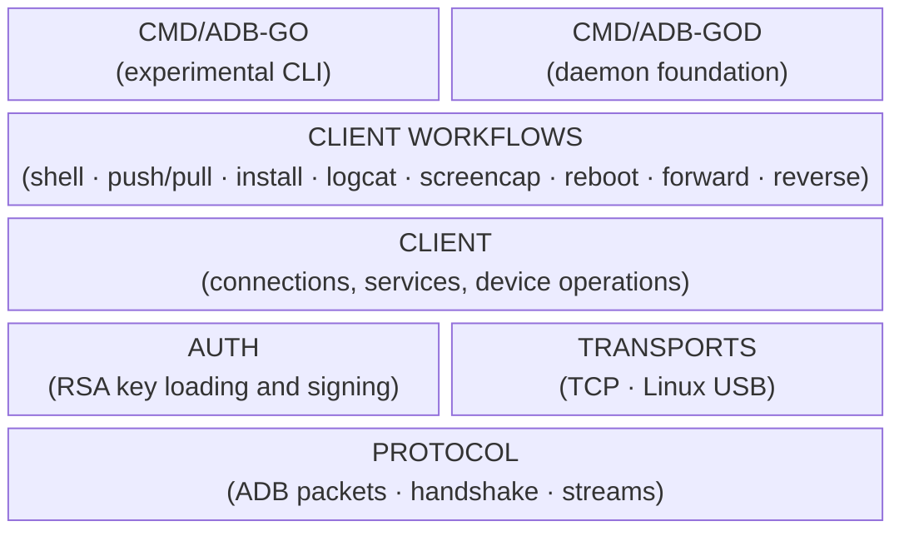

# adb-go

`adb-go` is a pure-Go implementation of the [ADB (Android Debug Bridge)](https://developer.android.com/tools/adb) protocol.

> [!NOTE]
> Current adb-go implementation is not a full replacement for the official `adb` binary yet.

## Contents

- [Overview](#overview)
- [Install](#install)
- [High-level client API](#high-level-client-api)
- [Linux USB support](#linux-usb-support)
- [Authentication helpers](#authentication-helpers)
- [Experimental CLI](#experimental-cli)
- [adb-god daemon foundation](#adb-god-daemon-foundation)
- [Low-level protocol package](#low-level-protocol-package)
- [Implementation notes](#implementation-notes)
- [Current limitations](#current-limitations)
- [Testing](#testing)

History of changes is available in [`CHANELOG.md`](CHANELOG.md).

## Overview

`adb-go` is layered from low-level ADB protocol primitives up to high-level
library workflows, with the CLI and daemon built on top.

Most probably you are here for [high-level client API](#high-level-client-api).



| Feature | Notes |
| --- | --- |
| TCP connections |  |
| USB connections | Linux only |
| USB device exploration | Linux only |
| Key authentication |  |
| Shell execution |  |
| Shell streaming |  |
| Service opening |  |
| Android properties |  |
| Logcat | Supports streaming and dump-and-exit modes |
| Screencap |  |
| Reboot | Supports normal, bootloader, and recovery modes |
| Local TCP forwarding | Device TCP targets only |
| Daemon-owned TCP forwarding | Device TCP targets only |
| Reverse TCP forwarding | Foreground process-scoped, device TCP to host loopback TCP |
| File push/pull |  |
| APK installation | Supports replace option |
| Sample CLI | Showcasing library |
| adb-god daemon foundation | Unix-socket daemon |

## Install

### As Go package

```sh
go get github.com/dector/adb-go
```

```go
import adb "github.com/dector/adb-go"
```

### As cli tool

Download [latest binary (snapshot)](https://github.com/dector/adb-go/releases/tag/snapshot) or use mise:

```sh
mise u -g "github:dector/adb-go@snapshot"
```

## High-level client API

Use the root package for the high-level API. It re-exports the `client`
package for connecting to a device, opening services, running shell commands,
reading Android system properties, streaming Android logs, capturing screenshots,
rebooting into supported modes, forwarding local TCP connections to device TCP
ports, reverse forwarding device TCP connections to host loopback TCP ports,
pushing or pulling one file, and installing one APK.

```go
ctx := context.Background()

c, err := adb.Connect(ctx, "127.0.0.1:5555")
defer c.Close()
```

Use shell:

```
out, err := c.Shell(ctx, "echo hello")
fmt.Printf("%s", out)
```

Read Android system properties:

```go
model, err := c.GetProp(ctx, adb.PropProductModel)
fmt.Println(model)

props, err := c.Properties(ctx)
fmt.Println(props[adb.PropBuildVersionSDK])
```

Stream Android log output:

```go
err := c.Logcat(ctx, os.Stdout, adb.LogcatOptions{})
```

or use dump-and-exit mode:

```go
err := c.Logcat(ctx, os.Stdout, adb.LogcatOptions{Dump: true})
```

Capture PNG screenshot:

```go
png, err := c.Screencap(ctx)
err = os.WriteFile("screen.png", png, 0o666)
```

Or (file must not exist):

```go
err := c.ScreencapFile(ctx, "screen.png")
```

Request a reboot:

```go
err := c.Reboot(ctx, adb.RebootNormal)
```

`Reboot` is disruptive: a successful request affects the selected device
immediately and may close the ADB connection as the device restarts.

Forward local TCP connections to a TCP endpoint on the selected device:

```go
remote, err := adb.ForwardTCP(8080)

forward, err := c.ForwardLocalTCP(ctx, "127.0.0.1:0", remote)
defer forward.Close()

fmt.Println("listening on", forward.LocalAddr())
err = forward.Wait()
```

This is process-scoped foreground forwarding. It is useful for bridging local
clients to a service listening on the device, but it is not an adb-server-backed
persistent `adb forward` registration.

Reverse device TCP connections to a host loopback TCP endpoint:

```go
remote, err := adb.ReverseDeviceTCP(8081)
local, err := adb.ReverseHostTCP(3000)

reverse, err := c.ReverseTCP(ctx, remote, local)
defer reverse.Close()

err = reverse.Wait()
```

This creates a device-side `tcp:8081` listener through adbd's reverse-forwarding
service. When device code connects to that port, adbd opens an ADB stream back
to adb-go and adb-go dials `127.0.0.1:3000` on the host. The reverse exists only
while the process owns the returned handle.

Install APK:

```go
err := c.InstallAPKWithOptions(ctx, "./app.apk", adb.InstallOptions{Replace: true})
```

The install helper intentionally is not a full clone of `adb install`; it pushes
the APK to `/data/local/tmp`, runs Android's package manager, and removes the
temporary file on a best-effort basis. More examples: [`client/README.md`](client/README.md).

## Linux USB support

On Linux, adb-go can connect directly through `/dev/bus/usb` without libusb.
Select the only visible ADB-capable interface, or provide a USB selector when
multiple devices are connected.

```go
c, err := adb.ConnectUSB(ctx, adb.USBOptions{
    DevicePath: "/dev/bus/usb/001/002",
})
```

Details and troubleshooting: [`client/README.md`](client/README.md#connect-over-linux-usb),
[`docs/linux-usb-transport.md`](docs/linux-usb-transport.md).

## Authentication helpers

Authenticated devices can use an explicitly supplied existing ADB RSA private
key. adb-go does not generate, discover, or persist keys in v0.

```go
credential, err := adb.LoadPrivateKey("/home/me/.android/adbkey")

c, err := adb.ConnectTCPWithOptions(ctx, "127.0.0.1:5555", adb.ConnectOptions{
    AuthCredentials: []adb.AuthCredential{credential},
})
```

Package docs: [`auth/README.md`](auth/README.md). Protocol details:
[`docs/authentication.md`](docs/authentication.md).

## Experimental CLI

The `adb-go` CLI is a thin wrapper around supported library workflows. It is not
a full clone of the official `adb` command.

```sh
go install github.com/dector/adb-go/cmd/adb-go@latest

adb-go version
adb-go shell --addr 127.0.0.1:5555 echo hello
adb-go push --addr 127.0.0.1:5555 ./local.txt /data/local/tmp/local.txt
adb-go pull --addr 127.0.0.1:5555 /data/local/tmp/remote.txt ./remote.txt
adb-go install-apk --addr 127.0.0.1:5555 ./app.apk
adb-go getprop --addr 127.0.0.1:5555 ro.product.model
adb-go getprop --addr 127.0.0.1:5555
adb-go logcat --addr 127.0.0.1:5555
adb-go logcat --dump --addr 127.0.0.1:5555
adb-go screencap --addr 127.0.0.1:5555 ./screen.png
adb-go reboot --addr 127.0.0.1:5555
adb-go reboot --addr 127.0.0.1:5555 recovery
adb-go forward --addr 127.0.0.1:5555 tcp:9000 tcp:9000
adb-go reverse --addr 127.0.0.1:5555 tcp:8081 tcp:3000
```

`adb-go version` prints the adb-go build version, Go runtime version, target OS,
and target architecture. Development builds report `dev`; release builds can
inject a Git-derived value with Go's standard linker flags. The helper
`./tools/git-version.sh` prints the latest semantic `vMAJOR.MINOR.PATCH` tag
as-is when `HEAD` is exactly on that tag and the worktree is clean. For clean
commits after the tag, it bumps the patch component and appends the zero-padded
commit distance, for example `v0.1.1-001`. Dirty worktrees append `-snapshot` to
that calculated version, for example `v0.1.1-001-snapshot`:

```sh
version=$(./tools/git-version.sh)
go build -ldflags "-X main.version=${version}" ./cmd/adb-go
```

CLI docs, including troubleshooting for common connection, authentication,
unsupported-platform, overwrite, and local-path errors:
[`cmd/adb-go/README.md`](cmd/adb-go/README.md).

## adb-god daemon foundation

`adb-god` is the first adb-go daemon process. It listens on a Unix domain socket
and supports `ping`, `status`, graceful `shutdown`, service diagnostics, and
in-memory daemon-owned TCP forwarding registrations. It does not persist devices,
transports, forwards, shell sessions, authentication state, or other ADB workflow
state across daemon restarts yet.

```sh
go install github.com/dector/adb-go/cmd/adb-god@latest
adb-god

adb-go daemon doctor
adb-go daemon status
```

On Linux with systemd user services, the CLI can install and manage `adb-god` as
a per-user service:

```sh
adb-go daemon service install
adb-go daemon service status
adb-go daemon service logs
```

Daemon design, socket selection, control protocol, troubleshooting, forwarding
health counters, and service management details:
[`docs/daemon-foundation.md`](docs/daemon-foundation.md). Daemon-backed
persistent forwarding behavior is described in
[`docs/persistent-forwarding-design.md`](docs/persistent-forwarding-design.md).

## Low-level protocol package

Advanced callers can use `protocol` for direct ADB packet, handshake, and stream
access. Most applications should use the high-level client API instead.

```go
conn := protocol.NewConnection(rw)
_, err := conn.Handshake(ctx)
```

Package docs: [`protocol/README.md`](protocol/README.md).

## Implementation notes

Architecture, package responsibilities, protocol flow, security model, and other
cross-cutting implementation notes live in [`docs/README.md`](docs/README.md).

## Current limitations

`adb-go` intentionally supports only a small v0 subset:

- Transport support is limited to explicit TCP endpoints and Linux USB via
  `/dev/bus/usb`; macOS and Windows USB are not implemented yet.
- ADB authentication requires explicit existing RSA key files.
- No broad device discovery, server management, or official `adb devices`
  compatibility in v0. The CLI has an adb-go-specific `targets` command.
- `adb-god` can own in-memory TCP forwarding listeners, but it does not persist
  devices, transports, forwards, sessions, or authentication state across daemon
  restarts yet.
- Incomplete command coverage: shell, shell streaming, generic service opening,
  Android property lookup, logcat streaming/dump, screenshot capture, reboot,
  foreground local TCP forwarding, single-file push/pull, and one-APK
  installation are the main supported workflows.
- APK installation is exposed as `install-apk`, an adb-go-specific helper rather
  than official `adb install` compatibility. It currently supports one local APK
  and the replace-existing-app option only.
- Property support intentionally covers common `getprop` reads through adb-go's
  `GetProp`/`Properties` helpers and CLI `getprop` command. Property names and
  values come from the connected device and should be treated as remote data.
- Logcat support intentionally covers only adb-go's `Logcat` helper and CLI
  `logcat` command with optional dump mode. It is not a full implementation of
  every official `adb logcat` filter, format, buffer, or output flag.
- Screencap support captures one PNG image through Android's `screencap -p`
  shell command. The CLI writes to a local PNG file and refuses to overwrite an
  existing path unless `--overwrite` is passed.
- Reboot support is intentionally explicit and disruptive. It currently supports
  normal, bootloader, and recovery modes through adb-go's `Reboot` helper and
  CLI `reboot` command; a successful request may close the ADB connection while
  the selected device restarts.
- Forwarding support covers foreground process-scoped TCP forwards/reverses and
  daemon-owned in-memory TCP forwards/reverses through `adb-go forward` and
  `adb-go reverse` background/list/remove commands. It does not emulate the
  official adb server's durable mapping store and does not support JDWP, Unix
  sockets, or other endpoint families yet.

More details are in the package READMEs and [`docs/README.md`](docs/README.md).

## Testing

Run the default unit and example suite with:

```sh
go test ./...
```

Optional integration tests are skipped by default. Set
`ADB_GO_INTEGRATION_ADDR` to run TCP tests against an already-running emulator,
TCP-enabled device, or manually started test daemon:

```sh
ADB_GO_INTEGRATION_ADDR=127.0.0.1:5555 go test ./...
```

The repository also includes opt-in workflows for the containerized Linux
`adbd` fixture and Linux USB transport tests. Full setup, prerequisites, and
troubleshooting notes are in [`docs/integration-testing.md`](docs/integration-testing.md).
